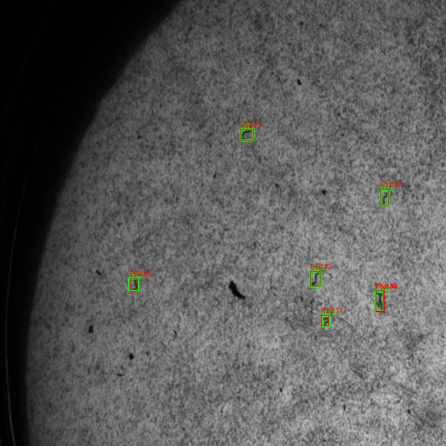
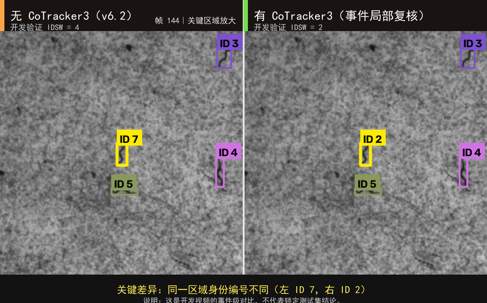

# C. elegans Microscopy Annotation Dataset

This repository contains curated annotations from *Caenorhabditis elegans* microscopy videos. The release is organized around three computer-vision tasks: object detection, instance segmentation, and multi-object identity tracking. Model weights, runtime caches, superseded backups, and unreviewed pseudo-labels are not included.

## Dataset contents

| File | Format | Split summary |
| --- | --- | --- |
| `c_elegans_detection_annotations_v2.zip` | YOLO detection | 90 training images and 10 validation images |
| `c_elegans_segmentation_annotations_v1.zip` | YOLO segmentation | 43 training, 10 validation, and 4 test images |
| `c_elegans_tracking_annotations_mot.zip` | MOTChallenge / CVAT MOT | Training, validation, and locked-test trajectory annotations |

The detection and segmentation archives contain `images/`, `labels/`, and a relative-path `data.yaml`, so they can be inspected or used for training after extraction. The tracking archive contains CVAT-exported `gt.txt` files, event records, source metadata, and format-validation reports.

## Visual examples

In the detection comparison, green boxes are manually verified annotations and red boxes are model predictions.

Held-out instance-segmentation example:

Cross-frame identity-tracking example:

Local identity recovery was applied only around high-risk tracking events. The following development-video comparison is event-level evidence and is not a locked-test result.

## Scope and limitations

- Detection v2 contains 100 manually verified images. The recorded evaluation results are Precision 0.995, Recall 0.984, and mAP50 0.994.
- Segmentation v1 contains 57 images. Its held-out test set has four images and 17 instances, which is sufficient for workflow validation but not for broad generalization claims.
- `35mm-90002` was the locked test sequence in the original experiments. It must not be used for threshold selection or model tuning when reproducing those results.
- The observed ID-switch reduction from 4 to 2 came from one development video and should be treated as event-level feasibility evidence.

## Integrity checks

`SHA256SUMS.txt` records SHA-256 hashes for the three archives and four preview images. `file_manifest.csv` lists file sizes and hashes for the release.

## Data use

This repository is public for research review and portfolio presentation. It does not grant an open license. Please contact the author before copying, redistributing, or using the files in a new training task.

Because the `35mm-90002` annotations are now public, they should not be treated as a blind holdout in future studies. New work should establish a separate, unpublished locked test set.

## Author and tools

- Author: Leslie Lin
- GitHub: [@haythamlin1015-pixel](https://github.com/haythamlin1015-pixel)
- Tools: Python, PyTorch, Ultralytics YOLO, OpenCV, CVAT, TrackEval, and CoTracker3

