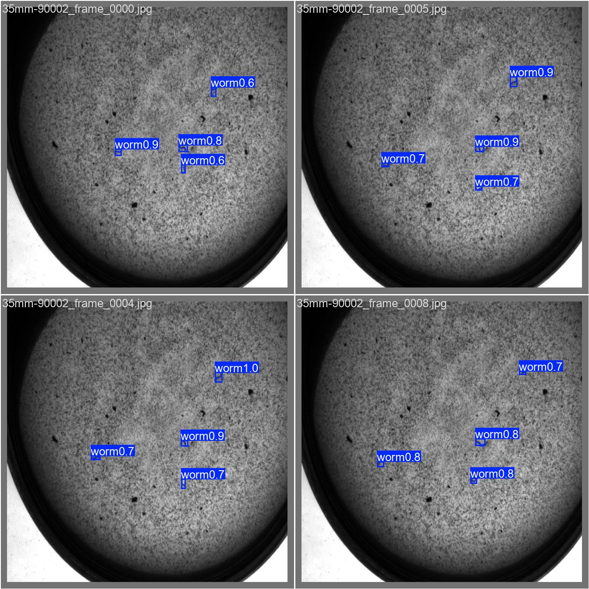
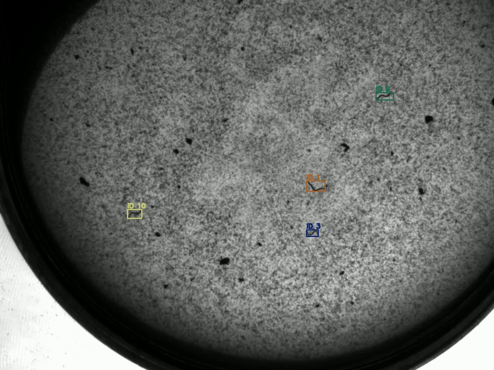

# SURF C. elegans microscopy annotations

这是我在 SURF 项目中整理和核验的秀丽隐杆线虫显微视频标注数据。仓库按任务拆成三个压缩包：目标检测、实例分割和多目标身份跟踪。这里保存的是可复现的数据版本，不包含模型权重、运行缓存、旧备份或未经复核的伪标签。

## 数据内容

| 文件 | 格式 | 数量 |
| --- | --- | --- |
| `surf_detection_v2.zip` | YOLO detection | 训练集 90 张，验证集 10 张 |
| `surf_segmentation_v1.zip` | YOLO segmentation | 训练集 43 张，验证集 10 张，测试集 4 张 |
| `surf_tracking_mot.zip` | MOTChallenge / CVAT MOT | 训练、验证和锁定测试三段轨迹标注 |

每个图像数据集都保留 `images/`、`labels/` 和相对路径版 `data.yaml`，解压后可以直接检查或用于训练。跟踪包保留 CVAT 导出的 `gt.txt`、事件记录和格式验证结果。

## 示例

检测结果中，绿色框为人工标注，红色框为模型预测：

实例分割独立测试样例：

跨帧身份跟踪样例：

CoTracker3 只用于高风险事件的局部身份复核。下面是开发视频中的事件级对比，不代表锁定测试集结果：

## 数据边界

- 检测 v2 含 100 张人工核验图像，正式测试结果为 Precision 0.995、Recall 0.984、mAP50 0.994。
- 分割 v1 只有 57 张图像，其中独立测试集为 4 张图、17 个实例；这个规模适合验证流程，不足以支持泛化结论。
- MOT 数据中的 `35mm-90002` 是锁定测试标注。不要根据该文件调整模型或阈值。
- CoTracker3 的 IDSW 4 到 2 来自单段开发视频，只作为事件级可行性证据。

## 校验

`checksums-sha256.txt` 记录了三个压缩包和四张预览图的 SHA-256。`manifest.csv` 列出文件大小和校验值。

## 使用说明

本仓库由作者公开，用于展示和复核 SURF 项目中的标注工作。当前未附带开放许可证；如需复制、再分发或将这些文件用于新的训练任务，请先联系作者确认使用范围。

`35mm-90002` 是本项目原有的锁定测试标注。公开后，它不再适合作为新研究中的盲测数据。复现实验时仍应保持原报告中的训练、验证和测试划分，不得依据测试标注回调参数；后续研究应重新建立未公开的锁定测试集。

## 项目信息

- 作者：Leslie Lin
- GitHub：[@haythamlin1015-pixel](https://github.com/haythamlin1015-pixel)
- 工具：Python、PyTorch、Ultralytics YOLO、OpenCV、CVAT、TrackEval、CoTracker3
